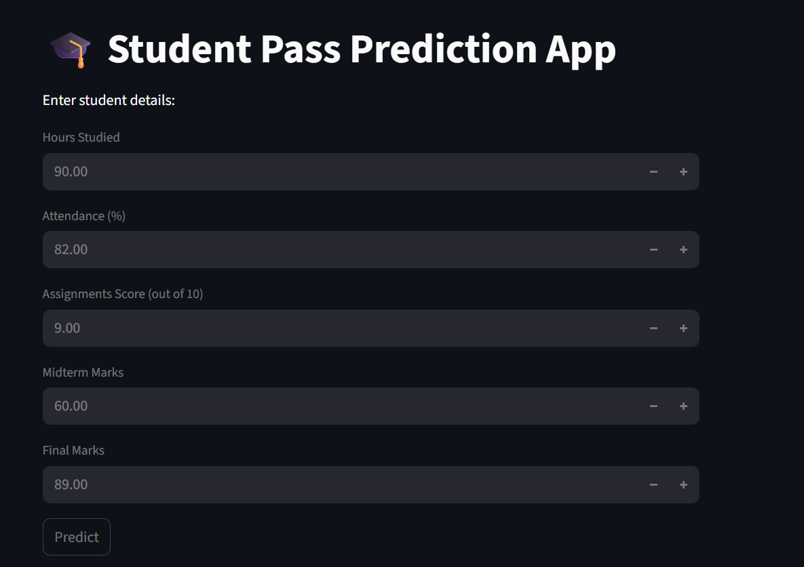
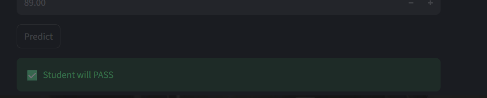

# 🎓 Student Pass Prediction System

A Machine Learning web application that predicts whether a student will **PASS or FAIL** based on academic performance.

---

## 📌 Project Overview

This project uses a **Machine Learning pipeline** to analyze student data such as study hours, attendance, assignments, and exam scores.
The best-performing model is selected, saved using **pickle**, and deployed using a **Streamlit web application**.

---

## 🚀 Features

* 📊 Data preprocessing and feature scaling
* 🤖 Multiple ML models training
* 🏆 Best model selection based on accuracy
* 💾 Model saving using Pickle
* 🌐 Interactive Streamlit web app
* ⚡ Real-time prediction

---

### Input->>


### Output->>

---
## 🗂️ Project Structure

```
student-ml-app/
│
├── app.py                # Streamlit web app
├── student_marks.csv     # Dataset
├── best_model.pkl        # Trained ML model
├── scaler.pkl            # Feature scaler
├── notebook.ipynb        # ML pipeline (training)
├── requirements.txt      # Dependencies
└── README.md             # Project documentation
```

---

## 📥 Input Features

The model takes the following inputs from the user:

| Feature Name  | Description                  |
| ------------- | ---------------------------- |
| Hours Studied | Daily study hours            |
| Attendance    | Attendance percentage (%)    |
| Assignments   | Assignment score (out of 10) |
| Midterm Marks | Midterm exam score           |
| Final Marks   | Final exam score             |

---

## 📤 Output

The model predicts:

* ✅ **PASS (1)** → Student is likely to pass
* ❌ **FAIL (0)** → Student is likely to fail

---

## 🧠 Machine Learning Models Used

* Logistic Regression
* Decision Tree Classifier
* Random Forest Classifier

👉 The model with the **highest accuracy** is selected as the final model.

---

## ⚙️ Installation & Setup

### 1. Clone the Repository

```
git clone https://github.com/your-username/student-ml-app.git
cd student-ml-app
```

### 2. Install Dependencies

```
pip install -r requirements.txt
```

### 3. Run the Application

```
python -m streamlit run app.py
```

---

## 🖥️ Application Interface

The user enters student details through the UI and clicks **Predict** to get results.

---

## 📊 ML Pipeline Workflow

```
Dataset → Preprocessing → Feature Scaling → Model Training 
→ Model Evaluation → Best Model Selection → Save Model → Deployment
```

---

## ⚠️ Important Notes

* `StudentID` is excluded from training as it does not impact prediction
* Ensure model and scaler files are in the same directory as `app.py`
* Always retrain the model if dataset changes

---

## 🔮 Future Enhancements

* 📈 Add visualization dashboards
* 🌍 Deploy on cloud (Streamlit Cloud / Render)
* 🧠 Improve accuracy with advanced models
* 📊 Add more features (CGPA, extracurriculars, etc.)

---

## 👨‍💻 Author

**Your Name**
MCA Student | MIT-WPU

---

## ⭐ If you like this project

Give it a ⭐ on GitHub!
